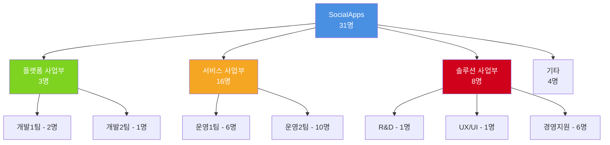

# SocialApps

<div align="center">
  
**Digital Agency**  
**Your Trusted Partner**

[](https://www.socialapps.co.kr)
[](mailto:happy@socialapps.co.kr)
[](tel:02-554-0515)

</div>

## 🏢 회사 개요

**2010년 설립되어 10여년간** 국내 굴지의 기업과 다수의 프로젝트를 진행하며 신뢰성과 전문성을 인정받은 소셜앱스는 **웹/모바일 시스템 구축 및 운영, UX 컨설팅 등 통합 서비스를 제공하는 디지털 에이전시**입니다.

### 📊 회사 정보

| 항목 | 내용 |
|------|------|
| **회사명** | 주식회사 소셜앱스 |
| **대표이사** | 박정용 |
| **사업자등록번호** | 120-87-49822 |
| **설립일** | 2010년 1월 14일 |
| **자본금** | 4억 5천만원 |
| **매출액** | 27억원 |
| **직원수** | 31명 |
| **웹사이트** | www.socialapps.co.kr |
| **주소** | 서울시 송파구 법원로11길 7, C동 1325호 (문정동테지산업연세) |
| **연락처** | 02-554-0517 |
| **이메일** | happy@socialapps.co.kr |

## 🎯 비전 & 미션

> **Agile / Lean Growth Hacker**

빠르고 효율적인 성장을 위한 디지털 솔루션을 제공하여 고객의 비즈니스 성공을 돕습니다.

## 🏗️ 조직 구성

<div align="center">



</div>

### 🔧 플랫폼 사업부
- **전문분야**: e-Commerce/e-Biz 전문가, BackOffice, Web/App, 시스템 개발

### 🚀 서비스 사업부  
- **전문분야**: 시스템 운영/기술지원 및 가이드, 시스템 기능 개발/확장/고도화, 시스템 업그레이드 대응

### 💡 솔루션 사업부
- **전문분야**: 가치창조 우선, 지속적인 연구 개발, 컨설팅 서비스

## 💼 주요 서비스

### 🌐 Web & APP Publishing
- 반응형 웹사이트 개발
- 모바일 애플리케이션 개발 (Android/iOS)
- 백오피스 시스템 구축

### 🎨 UI/UX
- 사용자 경험 설계
- 인터페이스 디자인
- 사용성 테스트 및 개선

### ⚙️ DevOps
- 시스템 운영 및 관리
- 성능 최적화
- 인프라 구축 및 유지보수

## 🏆 주요 고객사

### 대형 유통/쇼핑
- **롯데홈쇼핑**: 쇼핑몰 시스템
- **신세가에 LIVE SHOPPING**: 라이브 커머스 플랫폼
- **GS리테일**: B2B 패셔널 시스템
- **홈플러스**: 쇼핑몰 시스템

### 패션/라이프스타일
- **ABC마트**: 모바일 앱
- **올리브영 글로벌**: 글로벌 쇼핑몰
- **W쇼핑**: 쇼핑몰 시스템

### 기술/제조업
- **삼성전자**: 쇼핑몰 시스템
- **삼성카드**: 쇼핑몰 시스템
- **현대자동차**: 온라인 CPO 플랫폼
- **LG전자**: 다양한 프로젝트
- **LG U+**: 서비스 플랫폼
- **한화**: 헬스업 시스템
- **KT**: 통신 서비스
- **소니**: 고도몰 이전 앱

### 금융/서비스
- **신한은행**: 온라인 경매 시스템
- **SM면세점**: 쇼핑몰 시스템
- **빗썸**: 가상화폐 거래소

## 🎖️ 주요 연혁

### 2024년
- 관광기업혁신대우차 굴즈기업 선정 (한국관광공사)

### 2023년  
- 플엔쇼핑 운영 (2016년 부터 현재)
- W쇼핑앱 운영 (2019년 부터 현재)
- ABC마트 앱 (2021년 부터 현재)
- CJ 올리브영 글로벌 쇼핑몰 운영 (2021년부터 현재)
- IDIS 파워빔 IP-PTT 시스템 유지관리 (2020년부터 현재)
- IDIS 파워빔 위치관제단말기 펌웨어 및 관리시스템 개발

### 2022년
- 신세계라이브쇼핑 네이티브 앱 고도화
- 현대차 CPO (인증중고차) 온라인 플랫폼 앱 구축
- SK증권 도금 주파수 3.0 운영관리
- 플엔쇼핑 안드로이드 앱 Kotlin 전환

### 2021년  
- GS리테일 하이브리드 앱 구축
- 소니스토어 고도몰 이전 앱 개발
- 플엔쇼핑 모바일 페이지 리뉴얼 개발
- 삼성혈관연구재단 TCTAP2021 앱 개발

## 🚀 대표 프로젝트: RyView.ai

## 📞 연락처

### 📧 일반 문의
- **이메일**: happy@socialapps.co.kr
- **전화**: 02-554-0515
- **웹사이트**: www.socialapps.co.kr

### 🏢 오시는 길
```
📍 서울시 송파구 법원로11길 7, C동 1325호
   (문정동테지산업연세)
```

---

<div align="center">
  
**© 2024 SocialApps Co., Ltd. All rights reserved.**

*Digital Agency - Your Trusted Partner*

</div>
